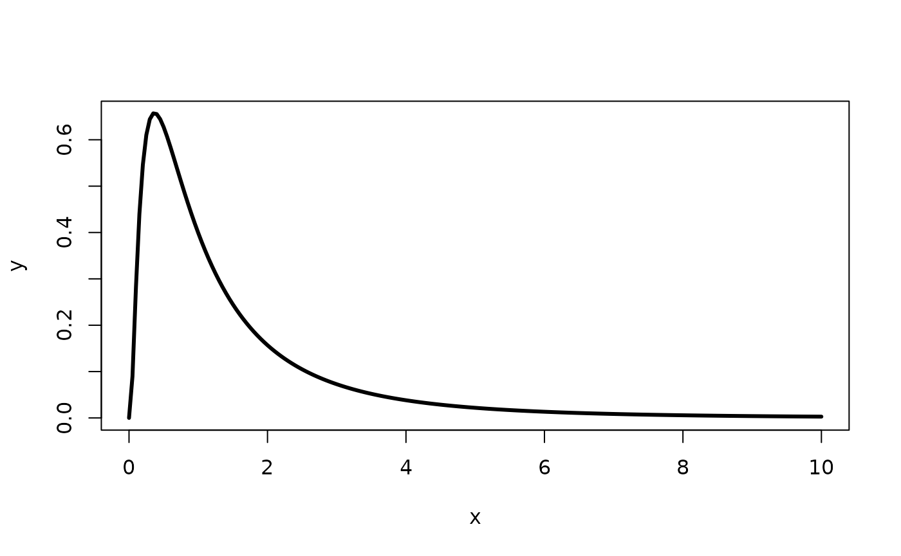
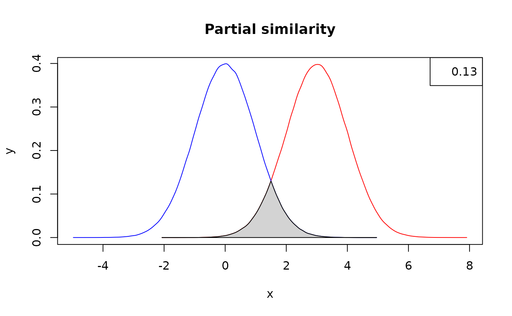

# Introduction to tbea

This vignette deals with more real-world examples than the documentation
examples. It complements the user manual and eventual published
references on the usage of the package.

The main place in evolutionary biology where the features contained in
`tbea` belong is in the core of divergence time estimation and
incorporation of paleontological and geological information into
estimation of the time component of phylogenies and diversification
analyses. Here, the tools present in the package aid in implementing
information from these fields into Bayesian analyses, mainly through
specification of priors, the most conspicuous feature of Bayesian
inference. However, prior specification is a very difficult task and
there are few if any rules to follow, along with a lot of
misunderstanding along with clearly-unjustified practices.

## Priors

Prior specification depends strongly on what we are trying to use in
order to calibrate a given phylogeny. For instance, node calibration and
tip calibration work in different ways, and prior specification will not
only depend on this but also on the nature of the information we are
trying to use as priors.

In the most common case, we have a fossil taxon (or occurrence) that
could inform us about the age of a given node (node calibration).
However, we lack exact information on two things: When the organism
lived (measured without error), and when a given diversification event
took place (i.e., the exact age of a node). What we have is a fossil,
whose age has been inferred or measured *with error* or *uncertainty*.
It is this information, uncertainty, what we expect to model through
priors (or at lease what should be done in real life). A prior is in
itself a probability density function (PDF hereafter), that is, a
mathematical function describing the probability that a variable take a
given value inside an given interval. More or less precise statements
can be made with aid of PDFs, such as that it is more likely that a
variable X takes a value between values a and b than rather between c
and d; or which is the expected value for the variable of interest.

Now, what we have is age information such as the following instances:

- The fossil comes from a volcanic layer that has been dated with
  radiometric techniques with a specific value $`\pm`$ uncertainty, for
  instance, 40.6 $`\pm`$ 0.5 Ma, where 0.5 is the standard deviation
  $`\sigma`$.

- The fossil comes from a sedimentary unit that is said to be of Miocene
  age (5.33 to 23.03 Ma).

- The fossil comes from a layer bracketed by two levels with volcanic
  ash that have been dated as 10.2 $`\pm`$ 0.2 and 12.4 $`\pm`$ 0.4
  respectively. So, the fossil itself have an age determined as
  interpolated between the layers that have real age information.

How can we convert this information into legitimate priors?

### The `findParams` function

Given that we have prior on the age of a fossil to be 1 - 10 Ma and that
we want to model it with a lognormal distribution, fin the parameters of
the PDF that best reflect the uncertainty in question (i.e., the
parameters for which the observed quantiles are 1, 5.5, and 10, assuming
that we want the midpoint to reflect the mean of the PDF:

``` r

tbea::findParams(q = c(1, 5.5, 10),
          p = c(0.025,  0.50, 0.975),
          output = "complete",
          pdfunction = "plnorm",
          params = c("meanlog", "sdlog"))
```

    ## Warning in tbea::findParams(q = c(1, 5.5, 10), p = c(0.025, 0.5, 0.975), :
    ## initVals not provided, will use the mean of quantiles in q for _each_ of the
    ## parameters. Parameter estimates might not be reliable even though convergence
    ## is reported.

    ## Warning in plnorm(q = c(1, 5.5, 10), meanlog = 1.5962890625, sdlog =
    ## -1.83852539062498): NaNs produced

    ## Warning in plnorm(q = c(1, 5.5, 10), meanlog = 1.5962890625, sdlog =
    ## -1.83852539062498): NaNs produced

    ## Warning in plnorm(q = c(1, 5.5, 10), meanlog = 0.397998046874998, sdlog =
    ## -1.16190185546872): NaNs produced

    ## Warning in plnorm(q = c(1, 5.5, 10), meanlog = 0.840979003906248, sdlog =
    ## -0.149819946289039): NaNs produced

    ## Warning in plnorm(q = c(1, 5.5, 10), meanlog = 1.3444351196289, sdlog =
    ## -0.0238803863525183): NaNs produced

    ## Warning in plnorm(q = c(1, 5.5, 10), meanlog = 1.83548833280802, sdlog =
    ## -0.291388470306973): NaNs produced

    ## Warning in plnorm(q = c(1, 5.5, 10), meanlog = 1.86174815893173, sdlog =
    ## -0.0716773837804601): NaNs produced

    ## Warning in plnorm(q = c(1, 5.5, 10), meanlog = 1.7567301876843, sdlog =
    ## -0.09538053739814): NaNs produced

    ## $par
    ## [1] 1.704744 0.305104
    ## 
    ## $value
    ## [1] 0.0006250003
    ## 
    ## $counts
    ## function gradient 
    ##      101       NA 
    ## 
    ## $convergence
    ## [1] 0
    ## 
    ## $message
    ## NULL

Now we have a published study that specified a lognormal prior (with or
without justification, that’s another question) and we want to actually
plot it outside of `beauti`, for instance, in order to assess similarity
between the posterior and the prior. How can we plot it in R and use its
data as any other statistical density?

### The `lognormalBeast` function

Generate a matrix for the lognormal density with mean 1 and standard
deviation 1, with mean *in real space*, and spanning values in x from 0
to 10, and then plot it:

``` r

lnvals <- tbea::lognormalBeast(M = 1, S = 1, meanInRealSpace = TRUE, from = 0, to = 10)
plot(lnvals, type = "l", lwd = 3)
```



## Density similarity

One hot topic in model and tool comparisons is the similarity of the
posterior to the prior, that is, how much could our results resemble de
distribution set in the prior. For instance, if the posterior is
identical to the prior, that means that the likelihood (or the data) is
not providing information, and this is very risky as there would be the
potential to manipulate the results of Bayesian analyses.

### The `measureSimil` function

Measure and plot the similarity between two distributions partially
overlapping:

``` r

set.seed(1985)
colors <- c("red", "blue", "lightgray")
below <- tbea::measureSimil(d1 = rnorm(1000000, mean = 3, 1),
                       d2 = rnorm(1000000, mean = 0, 1),
                       main = "Partial similarity",
                       colors = colors)
legend(x = "topright", legend = round(below, digits = 2))
```

 The number in the
legend indicates an overlap of 0.13, and as such, a measure of
similarity between the densities.

## Geochronology

In the third case of possible age estimates for our calibrations, can we
clump together a number of age estimates from several samples in order
to build a general uncertainty for the interval?

Do the age estimates for the boundaries of the Honda Group (i.e.,
samples at meters 56.4 and 675.0) conform to the isochron hypothesis?

``` r

data(laventa)
hondaIndex <- which(laventa$elevation == 56.4 | laventa$elevation == 675.0) 
mswd.test(age = laventa$age[hondaIndex], sd = laventa$one_sigma[hondaIndex])
```

    ## [1] 3.697832e-11

The p-value is smaller than the nominal alpha of 0.05, so we can reject
the null hypothesis of isochron conditions.

Do the age estimates for the samples JG-R 88-2 and JG-R 89-2 conform to
the isochron hypothesis?

``` r

twoLevelsIndex <- which(laventa$sample == "JG-R 89-2" | laventa$sample == "JG-R 88-2")
dataset <- laventa[twoLevelsIndex, ]
# Remove the values 21 and 23 because of their abnormally large standard deviations
tbea::mswd.test(age = dataset$age[c(-21, -23)], sd = dataset$one_sigma[c(-21, -23)])
```

    ## [1] 0.993701

The p-value is larger than the nominal alpha of 0.05, so we cannot
reject the null hypothesis of isochron conditions
