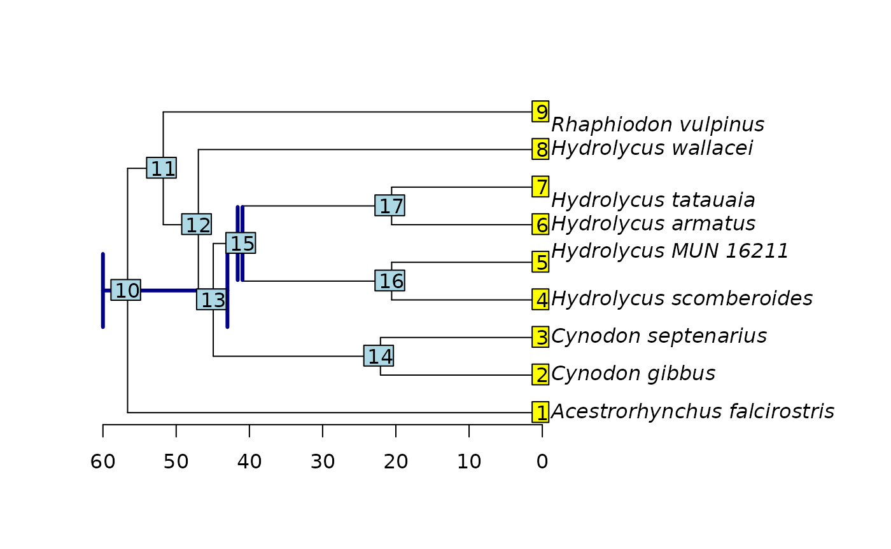

# Starting trees and how to specify them

Initial trees are used in three different ways in a divergence time
estimation analysis: Random trees when (i) the topology and divergence
times are co-estimated (e.g., `Beast2`), and user-defined trees when
(ii) complex analyses are carried out comprising several terminals and
multiple calibration points, and therefore a good initial tree helps
reach convergence, and (iii) when we want to fix the topology and just
estimate divergence times.

However, node times must be compatible with the calibration densities,
otherwise, the likelihood of the initial tree is zero, and thus, their
posterior probability. This generates an issue in programs such as
`Beast2` which will try a finite (e.g., $`100`$) number of tree
proposals; if all these fail, the analysis will not start.

Initial trees are challenging to prepare by hand because they need to be
consistent with all node calibrations, in order to the initial product
of likelihood and priors is different from zero. Node times need to be
within the domain of the calibration distribution, so that branch length
need to be specified accordingly. We can infer initial trees using a
fast method such as maximum likelihood or maximum parsimony. If the
latter is used for inferring an initial tree, `TNT` is a popular
alternative to use. However, its format is specific to the program and
differs from standard newick, so it is impossible to use it as initial
tree in other types of analyses. `tbea` has a function for converting
from TNT tree format to standard newick, thus allowing to use parsimony
trees as initial proposals in Bayesian programs.

``` r

# load the packages
library(tbea)
library(ape)

# create a file with multiple trees in TNT format
writeLines(text=c("tread 'three arbitrary trees in TNT format'", 
                  "(Taxon_A ((Taxon_B Taxon_C)(Taxon_D Taxon_E)))*", 
                  "(Taxon_A (Taxon_B (Taxon_C (Taxon_D Taxon_E))))*", 
                  "(Taxon_A (Taxon_C (Taxon_B (Taxon_D Taxon_E))));", 
                  "proc-;"),
           con = "someTrees.tre")

# convert TNT to newick
tnt2newick(file="someTrees.tre", return=TRUE)
```

    ## [1] "(Taxon_A,((Taxon_B,Taxon_C),(Taxon_D,Taxon_E)));"
    ## [2] "(Taxon_A,(Taxon_B,(Taxon_C,(Taxon_D,Taxon_E))));"
    ## [3] "(Taxon_A,(Taxon_C,(Taxon_B,(Taxon_D,Taxon_E))));"

``` r

# cleanup after the example
file.remove("someTrees.tre")
```

    ## [1] TRUE

In order to generate a tree in which node times are consistent with the
calibration priors we can use a fast method such as penalized likelihood
(implemented in the `ape` package) using the initial tree and our set of
node calibrations:

``` r

# read tree with ape
tree <- read.tree(text="(Acestrorhynchus_falcirostris:0.1296555,
                        ((((Cynodon_gibbus:0.002334399,Cynodon_septenarius:0.00314063)
                        :0.07580842,((Hydrolycus_scomberoides:0.007028806,Hydrolycus_MUN_16211
                        :0.009577958):0.0225477,(Hydrolycus_armatus:0.002431794,
                        Hydrolycus_tatauaia:0.002788708):0.02830852):0.05110053)
                        :0.02656745,Hydrolycus_wallacei:0.01814363):0.1712442,
                        Rhaphiodon_vulpinus:0.04557667):0.1936416);")

# get the node IDs according to the mrca of pairs of appropriate
# species root
mrca(tree)["Acestrorhynchus_falcirostris", "Hydrolycus_armatus"]
```

    ## [1] 10

``` r

# Hydrolycus sensu stricto (cf. Hydrolycus)
mrca(tree)["Hydrolycus_scomberoides", "Hydrolycus_armatus"]
```

    ## [1] 15

``` r

# specify calibrations as a data frame
calibs <- data.frame(node=c(10, 15),
                     age.min=c(43, 40.94),
                     age.max=c(60, 41.6),
                     stringsAsFactors=FALSE)

# calibrate the tree with the information in calibs using ape
set.seed(15)
calibrated <- chronos(phy=tree, calibration=calibs)
```

    ## 
    ## Setting initial dates...
    ## Fitting in progress... get a first set of estimates
    ##          (Penalised) log-lik = -2.287137 
    ## Optimising rates... dates... -2.287137 
    ## Optimising rates... dates... -2.286842 
    ## Optimising rates... dates... -2.286299 
    ## Optimising rates... dates... -2.285826 
    ## Optimising rates... dates... -2.285409 
    ## Optimising rates... dates... -2.285041 
    ## Optimising rates... dates... -2.284715 
    ## Optimising rates... dates... -2.284423 
    ## Optimising rates... dates... -2.284154 
    ## Optimising rates... dates... -2.283918 
    ## Optimising rates... dates... -2.283706 
    ## Optimising rates... dates... -2.283513 
    ## Optimising rates... dates... -2.283338 
    ## Optimising rates... dates... -2.283176 
    ## Optimising rates... dates... -2.283028 
    ## Optimising rates... dates... -2.282891 
    ## Optimising rates... dates... -2.282766 
    ## Optimising rates... dates... -2.282649 
    ## Optimising rates... dates... -2.282541 
    ## Optimising rates... dates... -2.282441

    ## Warning: Maximum number of dual iterations reached.

    ## 
    ## log-Lik = -2.279378 
    ## PHIIC = 52.56

``` r

# plot the calibrated tree
plot(calibrated, label.offset=1.2)
axisPhylo()

# fetch the plotted tree from the graphic environment
plttree <- get("last_plot.phylo", envir=.PlotPhyloEnv)

# process the node heights and reorder as needed
nodes <- cbind(plttree$xx, plttree$yy)
nodes <- nodes[c(10, 15),]
nodes <- cbind(nodes, calibs[, c("age.min", "age.max")])
colnames(nodes) <- c("x", "y", "min", "max")
nodes <- cbind(nodes, rev.min=-(nodes[, c("min")] - max(plttree$xx)))
nodes <- cbind(nodes, rev.max=-(nodes[, c("max")] - max(plttree$xx)))

# plot the original calibrations as error bars
arrows(x0=nodes[, "rev.max"], x1=nodes[, "rev.min"],
       y0=nodes[,"y"], y1=nodes[,"y"],
       angle=90, length=0.3, lwd=3,
       code=3, col="darkblue")

nodelabels()
tiplabels()
```



``` r

# write the tree
write.tree(phy=calibrated)
```

    ## [1] "(Acestrorhynchus_falcirostris:56.63484744,((((Cynodon_gibbus:22.10239036,Cynodon_septenarius:22.10239036):22.83581459,((Hydrolycus_scomberoides:20.57344414,Hydrolycus_MUN_16211:20.57344414):20.36655586,(Hydrolycus_armatus:20.57862347,Hydrolycus_tatauaia:20.57862347):20.36137653):3.998204946):2.031301698,Hydrolycus_wallacei:46.96950664):4.794354381,Rhaphiodon_vulpinus:51.76386102):4.870986415);"
